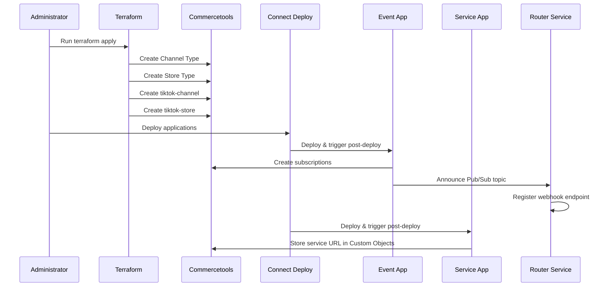
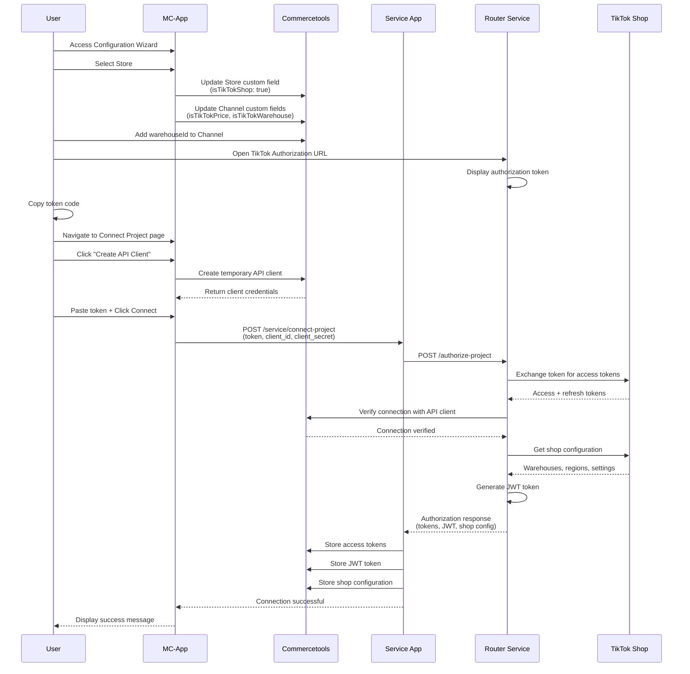
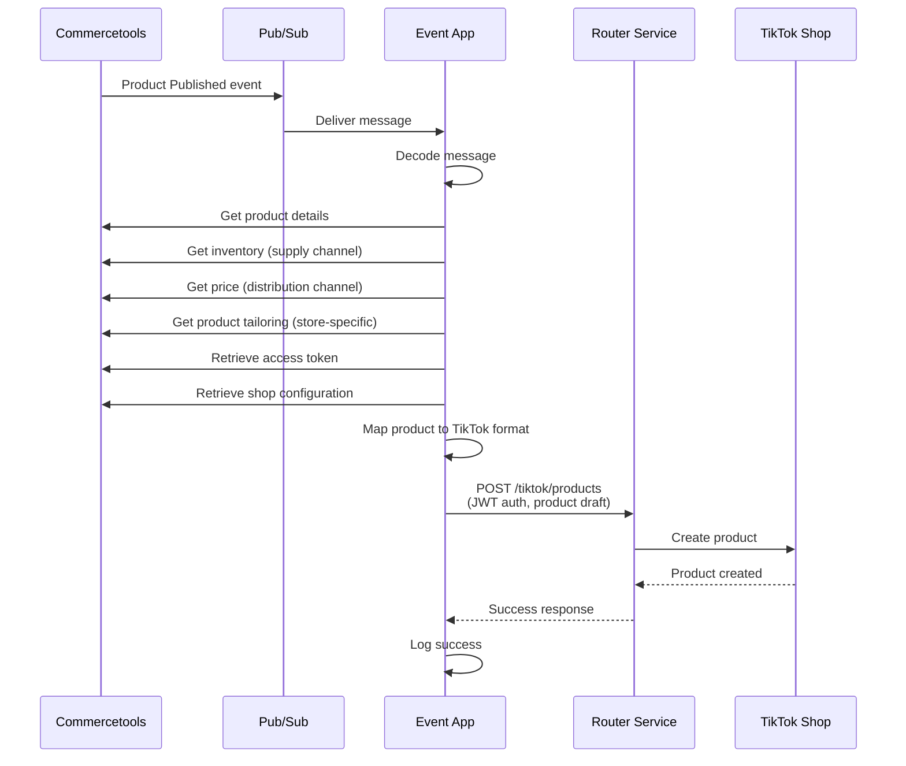
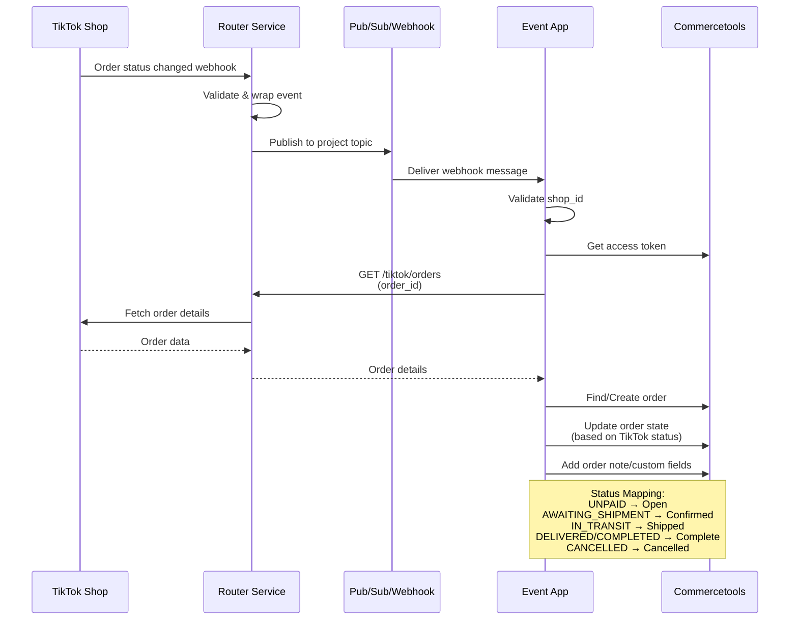
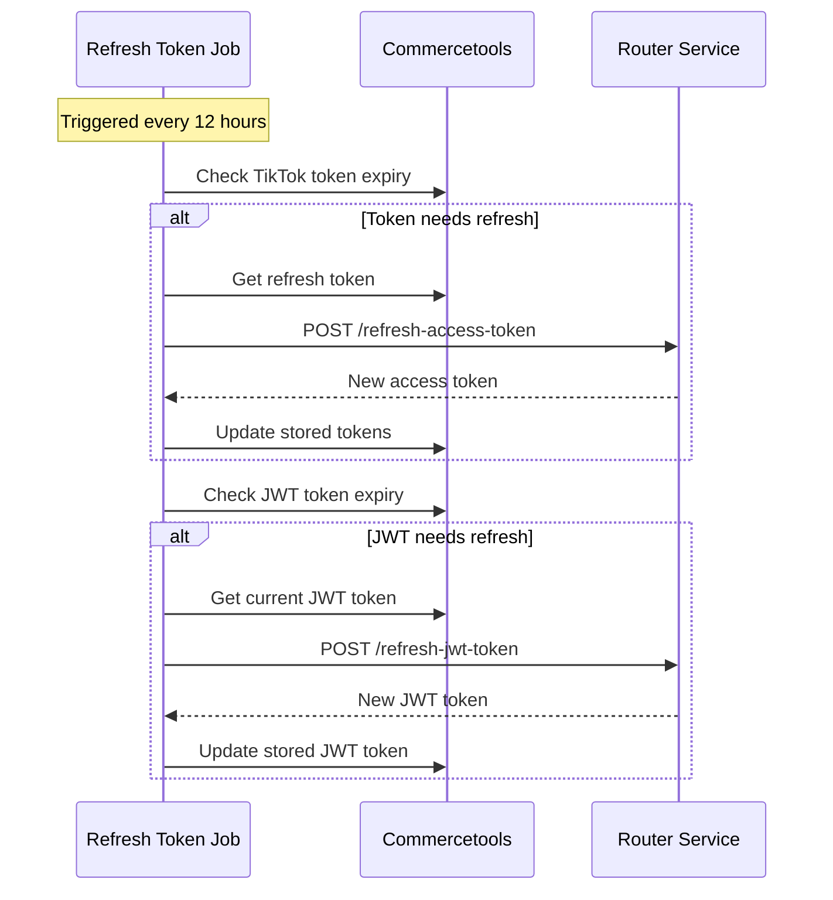

# TikTok Shop Integration for Commercetools

> **NOTE**: This is NOT an official commercetools code and NOT production ready. Use it at your own risk.

## Overview

This connector application is designed to synchronize a commercetools instance with a single TikTok Shop. It enables bidirectional data flow between commercetools and TikTok, allowing products, inventory, and orders to be synchronized automatically.

The integration uses a **router-service** as a multitenant proxy that routes application requests to TikTok Shop, managing authentication and providing webhook capabilities for TikTok events.

## Architecture

The connector consists of four main applications:

### 1. Event Application
Listens to events from both commercetools and TikTok Shop. Handles:
- **Commercetools Events** (via Google Cloud Pub/Sub or Azure Service Bus):
  - Product lifecycle: `ProductCreated`, `ProductPublished`, `ProductUnpublished`, `ProductDeleted`
  - Inventory changes: `InventoryEntryCreated`, `InventoryEntryQuantitySet`, `InventoryEntryDeleted`
  - Product Tailoring: `ProductTailoringCreated`, `ProductTailoringPublished`, `ProductTailoringUnpublished`, `ProductTailoringDeleted`
- **TikTok Webhook Events**:
  - Order status changes (Type 1): `UNPAID`, `ON_HOLD`, `AWAITING_SHIPMENT`, `IN_TRANSIT`, `DELIVERED`, `COMPLETED`, `CANCELLED`
  - Reverse order updates (Type 2): Returns and cancellations

### 2. Service Application
Provides HTTP endpoints for manual operations and acts as the main backend service:
- `/service/connect-project`: Authorizes and connects the commercetools project with TikTok Shop via router-service
- `/service/full-product-sync`: Triggers a complete product synchronization from commercetools to TikTok
- `/service/selective-product-sync`: Syncs specific products by ID
- `/service/full-product-check`: Validates which products can be imported to TikTok
- `/service/shop-config-sync`: Synchronizes shop configuration data

### 3. MC-App (Merchant Center Application)
A custom Merchant Center application that provides a user interface for:
- **Configuration Wizard**: Allows users to select a commercetools Store and Channel for TikTok integration
- **Connection Setup**: Guides users through the TikTok authorization process
- **Product Mapping**: Configure product attribute mappings between commercetools and TikTok

### 4. Refresh Token Job
A scheduled job (runs every 12 hours) that:
- Refreshes TikTok access tokens before they expire
- Refreshes JWT tokens used for router-service authentication
- Ensures continuous operation without manual intervention

## Requirements

### Prerequisites

1. **TikTok Authorization URL**: Obtain this from the commercetools partner account and send it to the TikTok Shop owner
2. **Router Service**: Must be deployed, configured, and installed
3. **Commercetools Project**: An active commercetools Composable Commerce project
4. **Terraform**: For provisioning custom types in commercetools

### Environment Variables

#### Standard Configuration
| Variable | Description | Required | Default |
|----------|-------------|----------|---------|
| `CTP_REGION` | commercetools API region | Yes | `europe-west1.gcp` |
| `CTP_PROJECT_KEY` | commercetools project key | Yes | - |
| `CTP_CLIENT_ID` | commercetools client ID | Yes | - |
| `CTP_SCOPE` | commercetools client scope | Yes | - |
| `TIKTOK_SHOP_CODE` | TikTok shop code | No | - |
| `TIKTOK_SHOP_ID` | TikTok shop ID | Yes | - |
| `TIKTOK_SHOP_NAME` | TikTok shop name | Yes | - |
| `ROUTER_SERVICE_URL_ENDPOINT` | Router service URL | Yes | - |
| `FEATURE_FLAG_ENABLE_TEST_TIKTOK_ROUTES` | Enable test routes | No | `false` |

#### Secured Configuration
| Variable | Description | Required |
|----------|-------------|----------|
| `CTP_CLIENT_SECRET` | commercetools client secret | Yes |

### Terraform Setup

The Terraform configuration creates the necessary custom types in commercetools:

1. **Channel Type** (`tiktok-channel-type`):
   - `isTikTokWarehouse` (Boolean): Marks the channel as the TikTok warehouse
   - `isTikTokPrice` (Boolean): Marks the channel as the TikTok pricing channel
   - `warehouseId` (String): TikTok warehouse ID
   - `warehouseEntityId` (String): Internal warehouse entity ID

2. **Store Type** (`tiktok-store-type`):
   - `isTikTokShop` (Boolean): Marks the store as the TikTok shop

3. **Default Resources**:
   - Creates a default `tiktok-channel` with both `ProductDistribution` and `InventorySupply` roles
   - Creates a default `tiktok-store` linked to the channel

#### Running Terraform

```bash
cd service/terraform

# Create secrets.tfvars file
cat > secrets.tfvars << EOF
ct_client_id="<your-client-id>"
ct_client_secret="<your-client-secret>"
ct_project_key="<your-project-key>"
ct_scopes="<scope-action>:<your-project-key>"
ct_api_url="https://api.<region>.<cloud>.commercetools.com"
ct_auth_url="https://auth.<region>.<cloud>.commercetools.com"
EOF

# Initialize Terraform
terraform init

# Preview changes
terraform plan -var-file secrets.tfvars

# Apply configuration
terraform apply -var-file secrets.tfvars
```

## Installation and Deployment

### Post-Deploy Processes

After deploying the applications to commercetools Connect, the following post-deploy hooks are executed automatically:

#### Event Application Post-Deploy
1. Creates a commercetools subscription for the configured Pub/Sub topic (GCP) or Service Bus (Azure)
2. Subscribes to product, inventory, and product-tailoring messages
3. Announces the Pub/Sub topic and project key to the router-service
4. Router-service registers the webhook endpoint for TikTok events

#### Service Application Post-Deploy
1. Stores the service application endpoint URL in commercetools Custom Objects
2. Makes the endpoint URL available to the MC-App for subsequent API calls

## Usage Flow

### Initial Setup and Configuration



### User Authorization Flow

Follow these steps to connect your commercetools project to TikTok Shop:

#### Step 1: Access MC-App and Complete Configuration Wizard
1. Navigate to the custom Merchant Center app
2. Complete the configuration wizard:
   - Select a Store (must have custom type `tiktok-store-type`)
   - The wizard sets `isTikTokShop: true` on the selected store
   - Automatically configures the associated channels:
     - Distribution channel: Sets `isTikTokPrice: true`
     - Supply channel: Sets `isTikTokWarehouse: true` (can be the same as distribution channel)

> **Important**: The selected store should NOT be your main commercetools store. Create a dedicated store for TikTok integration.

#### Step 2: Configure Warehouse ID
1. Log in to your TikTok Shop Seller Center
2. Navigate to **Settings** → **Warehouses**
3. Copy the Warehouse ID for your desired warehouse
4. In commercetools Merchant Center:
   - Go to **Settings** → **Channels**
   - Find your TikTok distribution channel
   - Edit the custom field `warehouseId` and paste the TikTok Warehouse ID

#### Step 3: Obtain TikTok Authorization Code
1. Open the **TikTok Authorization URL** (provided by commercetools partner)
2. The URL redirects you to the router-service authorization page
3. The router-service displays an authorization token code
4. Click the **Copy** button to copy the token to clipboard

#### Step 4: Create API Client and Connect
1. Return to the MC-App
2. Navigate to the **Connect Project** page
3. Click **Create API Client** button:
   - This creates a temporary commercetools API client
   - The client has necessary scopes for the router-service to verify the connection
4. Paste the authorization token code from Step 3 into the input field
5. Click **Connect** button
6. The application:
   - Sends the token and API client credentials to the service application
   - Service calls router-service's `/authorize-project` endpoint
   - Router-service:
     - Exchanges the token for TikTok access tokens
     - Verifies the commercetools connection using the API client
     - Retrieves shop configuration (warehouses, region, locale)
     - Generates a JWT token for subsequent API calls
     - Returns all data to the service application
   - Service stores:
     - TikTok access token and refresh token in Custom Objects
     - JWT token in Custom Objects
     - Shop configuration (shop cipher, region, locale, warehouse mappings)



### Product Synchronization Flow

Once configured, products are automatically synchronized when changes occur in commercetools:



#### Supported Product Events
- **Product Created/Published**: Creates a new product in TikTok Shop
- **Product Updated**: Updates existing product details, prices, or inventory
- **Product Unpublished**: Marks product as inactive in TikTok
- **Inventory Entry Created/Updated**: Syncs inventory quantities to TikTok warehouse
- **Product Tailoring**: Uses store-specific product data for TikTok

### Order Synchronization Flow

TikTok order updates are received via webhooks and synchronized to commercetools:



### Token Refresh Flow

The refresh token job runs every 12 hours to maintain active tokens:



## Manual Operations

### Full Product Sync

To manually trigger a full product synchronization:

```bash
curl -X GET https://<service-url>/service/full-product-sync
```

This will iterate through all products in the commercetools project (filtered by the configured store) and create/update them in TikTok Shop.

### Selective Product Sync

To sync specific products:

```bash
curl -X POST https://<service-url>/service/selective-product-sync \
  -H "Content-Type: application/json" \
  -d '{
    "productIds": ["product-id-1", "product-id-2"]
  }'
```

### Product Import Check

To validate which products can be imported:

```bash
curl -X GET https://<service-url>/service/full-product-check
```

Returns:
```json
{
  "importableProducts": ["product-id-1", "product-id-3"],
  "unimportableProducts": [
    {
      "productId": "product-id-2",
      "error": "Missing required attribute: brand"
    }
  ]
}
```

## Data Flow Summary

### Commercetools → TikTok Shop
- Products (with variants)
- Inventory quantities
- Product prices
- Product images and descriptions
- Product tailoring (store-specific customizations)

### TikTok Shop → Commercetools
- Order creation
- Order status updates
- Order line items
- Shipping information
- Customer information (limited)

## Troubleshooting

### Common Issues

1. **Products not syncing to TikTok**
   - Verify the product is published
   - Check that product has inventory in the configured supply channel
   - Confirm product has a price in the configured distribution channel
   - Review product custom fields for TikTok-specific requirements
   - Run `/service/full-product-check` to identify validation issues

2. **Authorization failures**
   - Ensure JWT token is not expired (check Custom Objects)
   - Verify router-service is accessible
   - Confirm TikTok access token is valid
   - Re-run the authorization flow if needed

3. **Orders not appearing in commercetools**
   - Check Event application logs for webhook processing errors
   - Verify `TIKTOK_SHOP_ID` matches the shop sending webhooks
   - Ensure router-service webhook registration is active
   - Confirm Pub/Sub subscription is active in commercetools

4. **Token refresh failures**
   - Check refresh token job logs
   - Verify router-service `/refresh-access-token` endpoint is accessible
   - Ensure refresh token stored in Custom Objects is valid
   - May require re-authorization if tokens are completely invalid

## Router Service Architecture

The router-service is a critical component that:

1. **Acts as a Proxy**: Routes all TikTok API requests through a centralized service
2. **Manages Authentication**: Handles OAuth token exchange and refresh
3. **Provides Multi-tenancy**: Supports multiple commercetools projects connecting to different TikTok Shops
4. **Registers Webhooks**: Configures TikTok Shop webhooks and forwards events to the correct project's Pub/Sub topic
5. **Issues JWT Tokens**: Provides short-lived JWT tokens for secure communication between applications

## Security Considerations

- TikTok access tokens and refresh tokens are stored in commercetools Custom Objects (not in environment variables)
- JWT tokens are used for authentication with router-service and are automatically refreshed
- Temporary API clients created during authorization should have minimal scopes
- Router-service validates all incoming requests and ensures proper tenant isolation
- Webhooks from TikTok are validated by shop_id to prevent cross-tenant data leaks

## Development and Testing

### Running Locally

Each application can be run locally for development:

```bash
# Event application
cd event
yarn install
yarn start:dev

# Service application
cd service
yarn install
yarn start:dev

# MC-App
cd mc-app
yarn install
yarn start

# Refresh Token Job
cd refresh-token-job
yarn install
yarn start:dev
```

### Test Routes

When `FEATURE_FLAG_ENABLE_TEST_TIKTOK_ROUTES=true`, the service application exposes additional test endpoints under `/service/tiktok/*` for debugging TikTok API interactions.

## Limitations and Known Issues

- Currently supports synchronization with a **single TikTok Shop** per commercetools project
- Product tailoring is used for store-specific customizations; ensure tailoring is properly configured
- Some TikTok product attributes may require manual mapping configuration
- Order fulfillment workflow is one-directional (TikTok → commercetools)
- No automatic handling of product returns (must be processed manually)

## Future Improvements

See TODO section in the original README for planned enhancements:
- Data job initialization after authorization
- Enhanced error logging to Custom Objects
- Support for TikTok Shop V2025 APIs
- Shop unverify/disconnect endpoint

## License

MIT

## Support

This is not an official commercetools product. Use at your own risk.
For issues and questions, please refer to your organization's support channels.